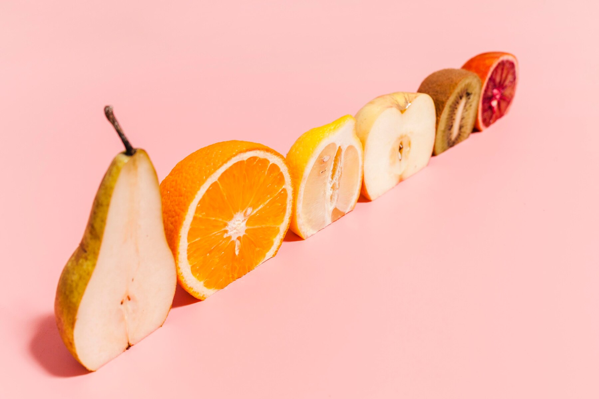

    <!-- Catagories -->
      <!-- <ul class="Head-Catagory">
        <h1>Our Products</h1>
        <li class="Head-Catagory-text">Apples</li>
        <li class="Head-Catagory-text">Cherries</li>
        <li class="Head-Catagory-text">Grapes</li>
        <li class="Head-Catagory-text">Oranges</li>
        <li class="Head-Catagory-text">Pears</li>
        <li class="Head-Catagory-text">Pineapple</li>
        <li class="Head-Catagory-text">Kewis</li>
        <li class="Head-Catagory-text">Watermelon </li>
      </ul>
     -->

     